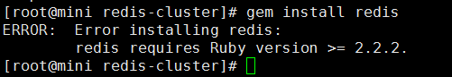

# Redis集群搭建 #

> 在紧要关头不敢赌上性命的人，把希望寄托于还有明年那种不确定未来的人，以及放弃机会的人，我认为像这样意志不坚定的废物根本就没资格成为中忍！——森乃伊比喜·火影忍者

## 1. 引语 ##

在Redis 3.0以前，提供了Sentinel工具来监控各Master的状态：如果Master异常，则会做主从切换，将slave作为master，将master作为slave；其配置也是稍微的复杂，并且在各方面表现一般，在发生主从切换的时候，可能还需要1、2秒的时间的，就可能造成写入数据失败。

现在redis 3.0已经支持集群的容错功能，并且非常简单。下面我们来进行学习redis 3.0如何搭建集群。 （搭建单节点Redis，可以参考[这里](https://github.com/lsieun/learn-redis/blob/master/redis.md)）

## 2. 搭建Redis cluster ##

集群搭建：至少要三个master

**第一步**：创建一个目录redis-cluster，然后在其下分别创建6个文件夹如下：

	mkdir -p /usr/local/redis-cluster/{7001,7002,7003,7004,7005,7006}

**第二步**：把之前的redis.conf配置文件分别copy到700\*下，进行修改各个文件内容，也就是对700*下的每一个copy的redis.conf文件进行修改！如下

	（1）daemonize yes
	（2）port 700* （分别对每个机器的端口号进行设置）
	（3）bind 192.168.80.30（必须绑定当前机器的ip，不然会无限悲剧下去哇。。。深坑勿入！！！）
	（4）dir /usr/local/redis-cluster/700*/（指定数据文件存放位置，必须要指定不同的目录位置，不然会丢失数据，深坑勿入！！！）
	（5）cluster-enabled yes（启动集群模式，开始玩耍）
	（6）cluster-config-file nodes700*.conf（）
	（7）cluster-node-timeout 5000
	（8）appendonly yes

以7001为例：

	################################ GENERAL  #####################################

	# By default Redis does not run as a daemon. Use 'yes' if you need it.
	# Note that Redis will write a pid file in /var/run/redis.pid when daemonized.
	daemonize yes
	
	# When running daemonized, Redis writes a pid file in /var/run/redis.pid by
	# default. You can specify a custom pid file location here.
	pidfile /var/run/redis7001.pid
	
	# Accept connections on the specified port, default is 6379.
	# If port 0 is specified Redis will not listen on a TCP socket.
	port 7001

	# By default Redis listens for connections from all the network interfaces
	# available on the server. It is possible to listen to just one or multiple
	# interfaces using the "bind" configuration directive, followed by one or
	# more IP addresses.
	#
	# Examples:
	#
	# bind 192.168.1.100 10.0.0.1
	# bind 127.0.0.1
	bind 192.168.80.30

	################################ SNAPSHOTTING  ################################

	# The filename where to dump the DB
	dbfilename dump.rdb
	
	# The working directory.
	#
	# The DB will be written inside this directory, with the filename specified
	# above using the 'dbfilename' configuration directive.
	#
	# The Append Only File will also be created inside this directory.
	#
	# Note that you must specify a directory here, not a file name.
	# dir ./
	dir /usr/local/redis-cluster/7001/

	################################ REDIS CLUSTER  ###############################

	# Normal Redis instances can't be part of a Redis Cluster; only nodes that are
	# started as cluster nodes can. In order to start a Redis instance as a
	# cluster node enable the cluster support uncommenting the following:
	#
	cluster-enabled yes
	
	# Every cluster node has a cluster configuration file. This file is not
	# intended to be edited by hand. It is created and updated by Redis nodes.
	# Every Redis Cluster node requires a different cluster configuration file.
	# Make sure that instances running in the same system do not have
	# overlapping cluster configuration file names.
	#
	cluster-config-file nodes-7001.conf
	
	# Cluster node timeout is the amount of milliseconds a node must be unreachable
	# for it to be considered in failure state.
	# Most other internal time limits are multiple of the node timeout.
	#
	cluster-node-timeout 15000

	############################## APPEND ONLY MODE ###############################
	
	# By default Redis asynchronously dumps the dataset on disk. This mode is
	# good enough in many applications, but an issue with the Redis process or
	# a power outage may result into a few minutes of writes lost (depending on
	# the configured save points).
	#
	# The Append Only File is an alternative persistence mode that provides
	# much better durability. For instance using the default data fsync policy
	# (see later in the config file) Redis can lose just one second of writes in a
	# dramatic event like a server power outage, or a single write if something
	# wrong with the Redis process itself happens, but the operating system is
	# still running correctly.
	#
	# AOF and RDB persistence can be enabled at the same time without problems.
	# If the AOF is enabled on startup Redis will load the AOF, that is the file
	# with the better durability guarantees.
	#
	# Please check http://redis.io/topics/persistence for more information.
	
	appendonly yes
	
	# The name of the append only file (default: "appendonly.aof")
	
	appendfilename "appendonly.aof"

> 注意：每个文件都要修改端口号，并且nodes-700*.conf文件也要不相同！

**第三步**：把修改后的配置文件，分别copy到各个目录下。

**第四步**：由于redis集群需要使用ruby命令，所以我们需要安装ruby

	(1) yum install ruby
	(2) yum install rubygems
	(3) gem install redis （安装redis和ruby接口）

如果此时出现redis requires Ruby version >= 2.2.2的报错（如下图），则在本文下方查找解决方法。

**第五步**：分别启动6个redis实例，然后检查是否启动成功

	(1) /usr/local/share/redis/bin/redis-server /usr/local/redis-cluster/700*/redis.conf
	(2) netstat -nltp | grep redis #查看是否启动成功

**第六步**：切换到redis 3.x.x的src目录下，然后执行redis-trib.rb命令

	(1)cd /usr/local/redis3.0/src
	(2) ./redis-trib.rb create --replicas 1 192.168.80.30:7001 192.168.80.30:7002 192.168.80.30:7003 192.168.80.30:7004 192.168.80.30:7005 192.168.80.30:7006 

> --replicas 1，其中1表示“主节点”与“从节点”的数量比例为1，即在6个redis节点中，有3个主节点，3个从节点。 

**第七步**：至此为止我们集群搭建成功！进行验证：

	#（1）连接任意一个客户端即可：./redis-cli -c -h -p 
	# 其中，-c表示集群模式，-h和-p 指定ip地址和端口号
	/usr/local/share/redis/bin/redis-cli -c -h 192.168.80.30 -p 7001

	#（2）进行验证：
	cluster info    #查看集群信息
	cluster nodes    #查看节点列表

	#（3）进行数据操作验证

	#（4）关闭集群，则需要逐个进行关闭，使用命令： 
	/usr/local/share/redis/bin/redis-cli -c -h 192.168.80.30 -p 700* shutdown

**第八步**：补充

	提示：当出现集群无法启动时，删除临时的数据文件，再次重新启动每一个redis服务，然后重新构造集群环境
	

## 3. redis requires Ruby version >= 2.2.2问题 ##

redis官方提供了redis-trib.rb工具，但是在使用之前 需要安装ruby，以及redis和ruby连接。

	(1) yum install ruby
	(2) yum install rubygems
	(3) gem install redis （安装redis和ruby接口）

其中 gem install redis命令执行时出现了：`redis requires Ruby version >= 2.2.2`的报错，查了资料发现是Centos默认支持ruby到2.0.0。可gem 安装redis需要最低是2.2.2

解决办法是，先安装rvm，再把ruby版本提升至2.3.3

**第一步**：安装curl

	yum install curl

**第二步**：安装RVM

	curl -L get.rvm.io | bash -s stable 

**第三步**：重新加载配置文件

	source /usr/local/rvm/scripts/rvm

**第四步**：查看rvm库中已知的ruby版本

	rvm list known

**第五步**：安装一个ruby版本

	rvm install 2.3.3

**第六步**：设置默认版本

	rvm use 2.3.3

**第七步**：卸载一个已知版本

	rvm remove 2.0.0

**第八步**：查看当前版本

	ruby --version

**第九步**：再安装redis就可以了

	gem install redis

## 4. 参考 ##

Redis cluster tutorial官方文档：[https://redis.io/topics/cluster-tutorial](https://redis.io/topics/cluster-tutorial)

> 至此结束

> 有形的东西迟早会凋零，但只有回忆是永远不会凋零的

