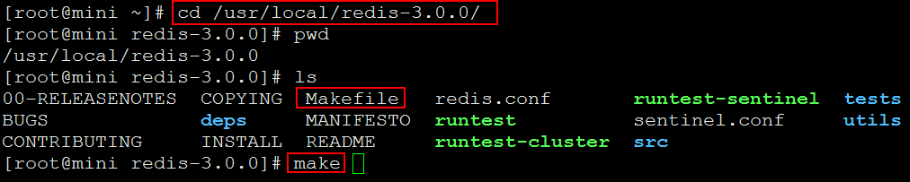
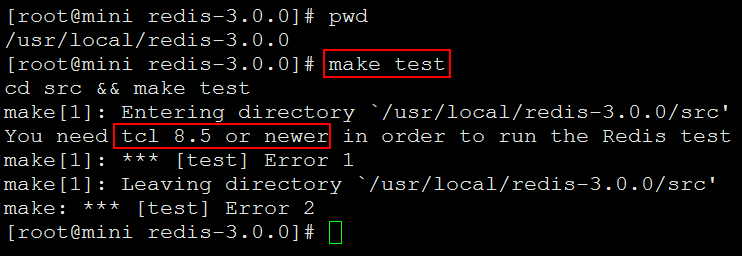
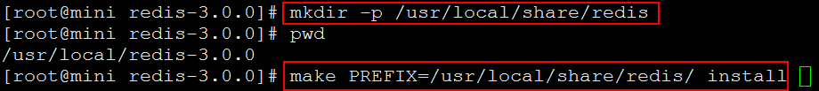
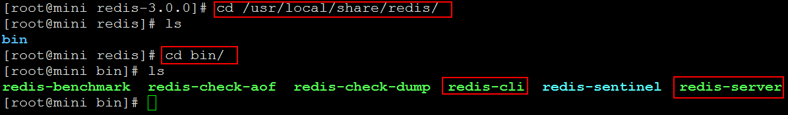
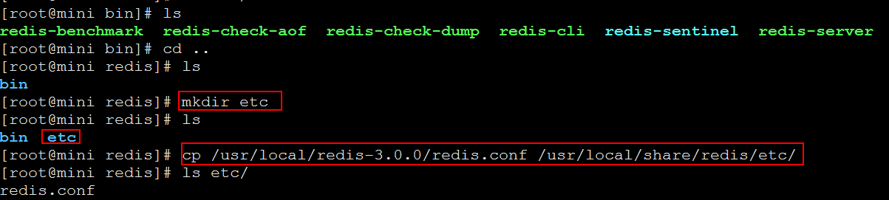
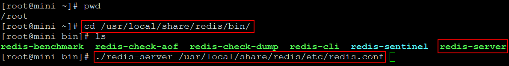
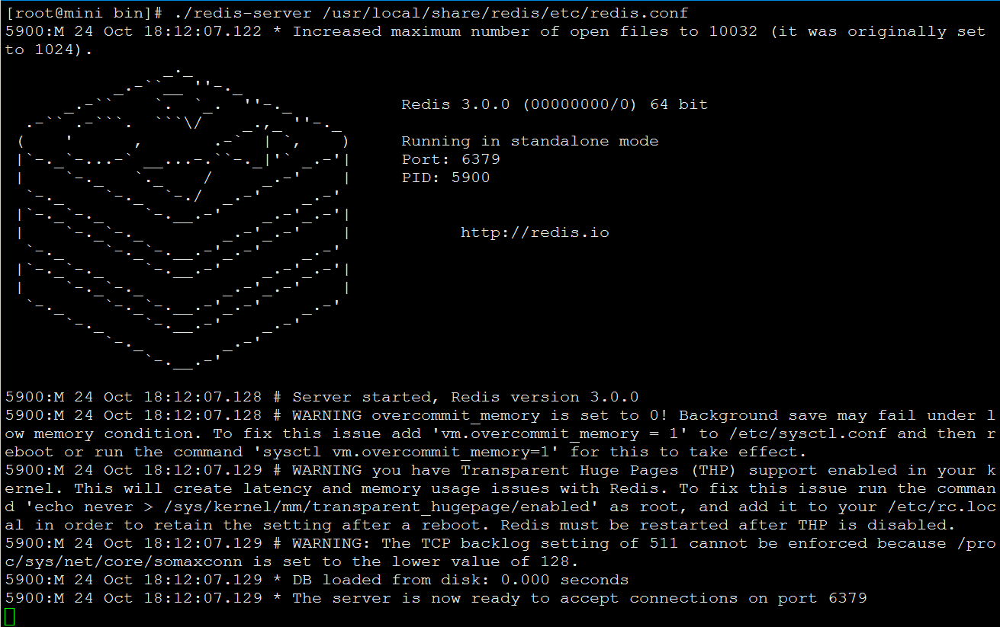

# Redis的安装 #

redis的安装步骤： 
   
	下载：下载地址  
	编译：前提gcc、编译两个步骤make和make install  
	安装：拷贝文件  
	启动：前台启动、后台启动  
	验证是否启动成功  

redis的配置 

## 1. 下载和解压 ##

下载地址: [https://redis.io/download](https://redis.io/download)

解压：将redis-3.x.x.tar.gz解压到linux的/usr/local/目录下

	tar -zxvf redis-3.0.0.tar.gz -C /usr/local/

## 2. 编译 ##

首先需要安装gcc

	yum -y install gcc
	

进入到redis-3.x.x目录下，进行编译make

	cd /usr/local/redis-3.0.0/
	make

----------

测试编译（可选）

	make test

可能会遇到如下错误提示：

这种情况，需要安装tcl，命令如下：

	yum -y install tcl

安装完成之后，再执行`make test`就不错报了

	make test

----------

## 3.安装 ##

这里提供两种安装方式，两种安装方式大同小异。

### 3.1 第一种安装方式 ###

安装到指定目录(/usr/local/share/redis/)

	mkdir -p /usr/local/share/redis    # 创建目录
	make PREFIX=/usr/local/share/redis/ install    #安装

安装(`make install`)验证: 查看安装之后的文件目录(/usr/local/share/redis/bin)，目录下有`redis-server`、`redis-cli`即可

	cd /usr/local/share/redis/bin
	ls

在安装目录（/usr/local/share/redis/）下添加etc目录，并将redis源代码目录下的redis.conf文件拷贝到etc目录下：

	mkdir etc
	cp /usr/local/redis-3.0.0/redis.conf /usr/local/share/redis/etc/

### 3.2 第二种安装方式 ###

4. 进入到src下进行安装make install验证 （II查看src）
5. 建立两个文件夹存放redis命令和配置文件 mkdir -p /usr/local/redis/{bin,etc}

	cd /usr/local/share/redis/
	ls

6. 把redis-3.0.0下的redis.conf移动到/usr/local/redis/etc下 cp redis.conf /usr/local/redis/etc/

	cp /usr/local/redis-3.0.0/redis.conf /usr/local/share/redis/etc/

7. 把redis-3.0.0/src下的mkreleasehdr.sh redis-benchmark redis-check-aof redis-check-dump redis-cli redis-server 文件移动到bin目录下： mv mkreleasehdr.sh redis-benchmark redis-check-aof redis-check-dump redis-cli redis-server /usr/local/redis/bin/

## 4. 启动redis ##

启动时并指定配置文件：

	cd /usr/local/share/redis/bin/
	./redis-server /usr/local/share/redis/etc/redis.conf

启动界面如下：

> 注意：要使redis后台启动，修改redis.conf里的daemonize为yes

验证redis服务是否启动成功：

	#查看是否有redis服务 
	ps -ef | grep redis 
	
	#或者 查看端口： 
	netstat -tunpl | grep 6379

退出redis服务：

	#第一种方式：
	pkill redis-server  

	#第二种方式：
	kill 进程号

	#第三种方式：
	/usr/local/redis/share/bin/redis-cli shutdown

进入redis客户端 

	./redis-cli 

退出redis客户端 

	> quit

> 至此结束

